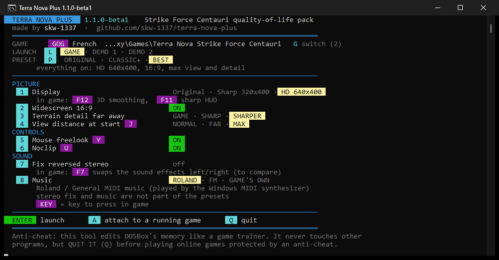
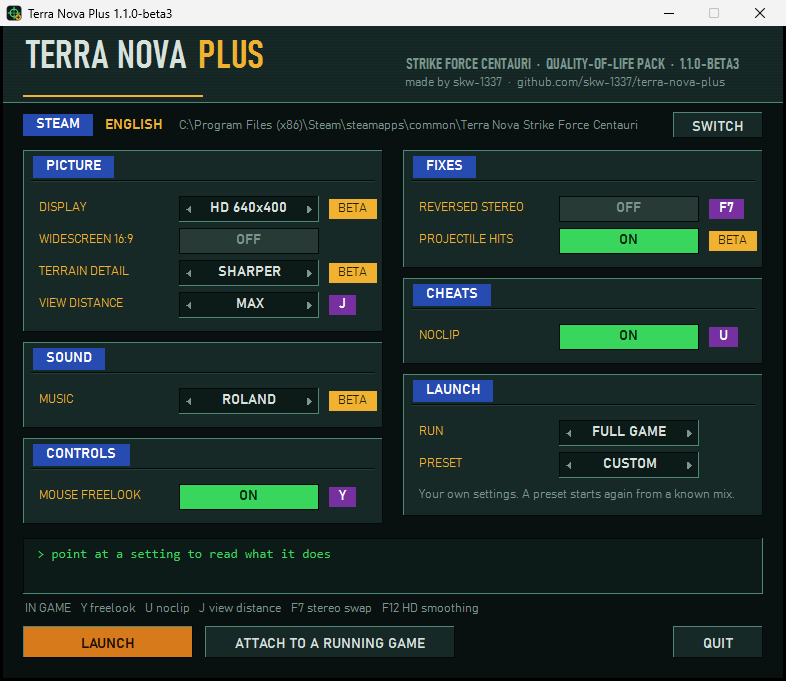

# Terra Nova Plus

**An all-in-one quality-of-life pack for *Terra Nova: Strike Force Centauri*** (Looking Glass Technologies, 1996), running in DOSBox — **Steam, GOG or standalone**.

One small external tool. Pick your options in its window, click Launch, and the game starts with them:

| Option | Key in game | What it does |
|---|---|---|
| **Mouse freelook** | `Y` | Mouse left/right turns your PBA, up/down looks up/down, the aiming reticle stays centred: you fire where you look. Smooth (~500 updates per second), no screen shake, no reticle trails on the cockpit. |
| **Noclip** | `U` | Free flight: your usual move keys, `Space` / `Left Ctrl` up/down, `Left Shift` ×4 speed. Great to explore the maps and look at the scenery. |
| **View distance** | `J` | `NORMAL` / `FAR` / `MAX`: the fog is pushed back, the horizon opens up. |
| **Force 320×400** | — | The engine's best resolution, applied automatically in every mission (the game normally only keeps it in save files). |
| **Widescreen 16:9** | — | DOSBox stretches the picture to 16:9 and the tool widens the engine's field of view by 33 % to match: correct proportions, more of the battlefield on the sides. |

**No game file is modified**: everything happens in memory while you play, and stops when you quit.

## 1.1.0 beta



This is a big one. I rewrote the launcher and added a bunch of things people asked for on TTLG, thanks to [](https://www.ttlg.com/forums/member.php?u=77813). It's a beta, so tell me what breaks.

### New launcher
- Since beta 3 it's a real window, in the colours of the game's cockpit. Hover a setting to read what it does at the bottom. `TNPlus.exe --console` keeps the old text menu.
- A badge shows which copy of the game you're launching: **GOG**, **STEAM** or **OTHER**, plus its language. If you have more than one install, **Switch** goes to the next one.
- **Presets**: ORIGINAL, CLASSIC+ and BEST. Change anything yourself and it shows CUSTOM.
- Display is a single choice (Original / Sharp 320x400 / HD 640x400), so you can't mix incompatible modes by accident. Click a selector to cycle its choices, right-click to go back.
- Settings are grouped: Picture, Sound, Controls, Fixes (things that are only needed if you have the problem), Cheats and Launch. In-game keys are shown in purple next to each option.
- A yellow **BETA** badge marks what is new in 1.1.0, and a red **EXPERIMENTAL** one what is still rough.

### HD 640x400
- The 3D view is drawn at twice the width, in the cockpit and in the full-screen view (`G` in game).
- `F12` toggles the 3D smoothing.
- Works with the GOG and Steam games, French and English (beta 3; before that it was French GOG only). The demos are next.

### Terrain detail
- More ground detail far away. Steep walls in the distance no longer turn into a saw blade. Costs around 10-20 % fps.

### Sound
- **Fix reversed stereo** (off by default): under DOSBox the game's Sound Blaster 16 driver swaps left and right, cutscenes included. The tool can start DOSBox with the channels swapped back.
- `F7` in game swaps the sound effects left/right on the fly, handy to compare.
- **Music**: Roland / General MIDI by default, or the original Sound Blaster FM, or whatever your config already says. Applied to the game and the demos when you launch them (the original `TN.CFG` is kept as `TN.CFG.tnplus-original`). "Roland" is the game's own *General MIDI / Roland SCC-1* setting, played by the Windows MIDI synth.

### AWE32 music (beta 2, experimental)

The game ships its own Sound Blaster AWE32 bank, `SOUND\FF.SBK`, made by its composer Eric Brosius, and the music it plays in General MIDI only uses the instruments of that bank. DOSBox can't emulate an AWE32, so the tool reads the bank, rebuilds it as a soundfont and lets DOSBox Staging play it with its built-in synth. Idea from [](https://www.ttlg.com/forums/member.php?u=77813).

The catch: nine sounds out of ten in that bank live in the ROM chip of the real card. That ROM belongs to Creative, so it is **not included** and the tool doesn't download it. To use the option:

1. Get `awe32.raw` (1 MB), the AWE32 ROM dump used by the 86Box emulator: go to [86Box/roms, sound/creative](https://github.com/86Box/roms/tree/master/sound/creative), click `awe32.raw`, then the download button on the right ("Download raw file").
2. Put it in the same folder as `TNPlus.exe` (keep the tool in its own folder, it writes a few files next to itself).
3. Start the launcher: AWE32 appears in the Music choices.

The check is done when the launcher starts, so restart it after copying the file. It looks for the exact name `awe32.raw`, in its own folder only (not the game's), and the file must be exactly 1 048 576 bytes: a truncated or different dump is ignored without a message. Without the file the choice isn't shown and music stays on Roland (a `music = AWE32` in `TNPlus.ini` falls back to Roland too). It's experimental: a few instruments are still slightly out of tune, and I have no real card to compare with. The percussion the bank doesn't define is played with the Windows sound set.

### Demos

**Run** picks the full game, demo 1 or demo 2. Both demos have missions that aren't in the full game. GOG and Steam already ship them (`TNDEMO1` and `TNDEMO2` next to `TNOVA`), so there's nothing to download. Freelook, noclip, view distance and 320x400 work in them too. HD doesn't yet.

If your install has no `TNDEMO1` / `TNDEMO2` folder (CD version): get the demos from the Internet Archive (Demo 2: [archive.org](https://archive.org/details/TerraNovaStrikeForceCentauriDemo), both are listed in [zjorz's setup guide on TTLG](https://www.ttlg.com/forums/showthread.php?t=149972)), install each one in DOSBox into `C:\TNDEMO1` and `C:\TNDEMO2` where `C:` is your game folder, and run their setup once. The tool looks for `TNDEMO.BAT` and `TN.CFG` in those folders. Demo files are not included here: they belong to the game's rights holders.

Stereo fix and demos need the tool to start DOSBox (Launch). With **Attach**, add `mixer sb reverse /noshow` at the top of your DOSBox `[autoexec]` instead, or use ripsaw8080's `SB16.DIG` patch (thanks to rfnagel and zjorz for pointing it out).

### Gameplay (beta 3 and 4)
- **Projectile hit fix** (on by default). Known bug since the 90s: with fast CPU cycles the multipulsar can't hit moving targets and drones become nearly immortal. Nightdive even dropped the Steam config to 115000 cycles because of it. Cause found in the game code: every frame a projectile checks the distance it just travelled against the entity grid, in steps of a fixed size, and the number of steps is rounded *down*. Above ~30 fps a pulsar bolt travels less than one step per frame, so the count is 0 and the bolt tests nothing: it can only hit the ground. The fix rounds the count up, and projectiles hit at any frame rate, yours and the enemies' alike (yes, the game gets a bit harder: that's how it was meant to play). Needed if you use the 300000 cycles the tool sets.
- **Physics speed fix** (beta 4, on by default). The game also walked faster the higher the frame rate: 2.0 game units per second at 37 fps, 3.3 at 76 fps, jumps and falls too. The physics engine kept a few milliseconds of leftover time that it added again on every frame. Cleared now: about 1.9 units per second at any frame rate.
- **End-of-mission freeze guard** (beta 4, always on). The game frees the cockpit's click zones when a mission ends but keeps testing the mouse against them for a moment, and could get stuck there forever on a black screen (it happened every time at the end of Panama with freelook at 500000 cycles). The routine that walks those zones now gives up after 255 steps, and freelook stops writing the cursor as soon as the game stops running frames.
- **Smoother walking** (beta 4, part of the physics fix). The physics skipped any frame shorter than 10 ms; above ~80 fps DOSBox gives 8 ms frames, so one frame in six had no movement and walking stuttered. Every frame is simulated now.
- **Object distance** (beta 4, GAME / FAR / MAX, MAX by default). Bushes, trees and rocks were only drawn within 20 terrain cells whatever the detail setting, and units and buildings within a range per type (20 cells for PBAs). FAR draws scenery up to 30 cells and doubles the ranges, MAX goes to 40 cells and triples them (120 cells at most). The engine's fixed-size object list and the limits of its entity walk are raised first so the extra objects fit. The game has no model LOD to improve: objects are always drawn with the same model. Measured on mission 12 in HD: 24 to 65 objects drawn per frame, 84 to 82 fps.

### Small stuff
- The tool starts DOSBox with 500000 CPU cycles since beta 4 (**CPU speed** in the launcher, `cpu_cycles` in `TNPlus.ini`, 0 to keep the edition's setting). The Steam and GOG configs ship with 115000, which makes the game crawl. Measured in HD on the same mission: 37 fps at 300000, about 50 at 400000, 62 at 500000, 76 at 600000; DOSBox only used half a CPU core at 500000. If the sound gets choppy, your PC can't keep up: pick a lower value. Higher speeds are safe for the gameplay thanks to the two fixes above.
- View distance moved from `I` to `J`: `I` is the game's infrared. Old settings files are updated on their own.

## Download & use

1. Download `TerraNovaPlus_v1.1.0-beta3.zip` from the [Releases](../../releases) page and unzip it anywhere.
2. Run **`TNPlus.exe`**. A window opens:

   

   Pick a preset or set things one by one, then click **Launch**. Your choices are saved in `TNPlus.ini`.
3. The window closes and a small console stays minimized in the taskbar. Play! When the game closes, the window comes back.

The game folder is detected automatically (**GOG** registry and **Steam** libraries). If you have both, **Switch** goes from one to the other. For any other install, start the game yourself and click **Attach**: everything works except widescreen, stereo fix and music, which need the tool to start DOSBox.

SHA-256 of `TNPlus.exe` v1.0.1: `8DEBF7EA5AE60536A01ED160BD30672B7B42D1D25011FFE0A19D7544C63EE996`

v1.0.1 adds version info and an icon to the exe (fewer antivirus false alarms). With **A** (attach), the window now stays open and says it is waiting for the game, and only minimizes once the game is found.

## Tips

- **Freelook** switches off by itself in the options screen (`O`), with `Esc` and when the mission ends; press `Y` again when you are back. Switch it off to click the cockpit buttons with the mouse.
- **Noclip**: land before switching it off — switching it off in mid-air means a free fall.
- **Widescreen** is anamorphic: the engine can only draw 320 pixels across, so the cockpit and the menus are stretched a little. The 3D view itself keeps correct proportions.
- Keys are **physical key positions**: `Y`, `U`, `J` are the same keys on QWERTY and AZERTY. They can be changed in `TNPlus.ini`.

## Settings (`TNPlus.ini`)

| Key | Default | Meaning |
|---|---|---|
| `freelook`, `noclip`, `force_320x400`, `widescreen` | `1`, `1`, `1`, `0` | the menu options |
| `view_distance` | `MAX` | `NORMAL`, `FAR` or `MAX` at start |
| `sensitivity_x`, `sensitivity_y` | `12`, `8` | mouse speed (heading / pitch units per mouse count) |
| `invert_y` | `0` | `1` = inverted vertical look |
| `noclip_speed` | `15` | game units per second (a walking PBA does about 2.5) |
| `key_freelook`, `key_noclip`, `key_distance` | `15`, `16`, `24` | **physical key scancodes** (hex): `15` = Y, `16` = U, `24` = J, `29` = key left of 1, `3B`–`44` = F1–F10 |
| `hit_fix` | `1` | `0` = leave the game's projectile hit test as it is (misses above ~30 fps) |
| `phys_fix` | `1` | `0` = leave the game's physics clock as it is (walks faster above ~30 fps) |
| `object_distance` | `MAX` | `GAME`, `FAR` or `MAX`: how far scenery, units and buildings are drawn |
| `cpu_cycles` | `500000` | DOSBox CPU cycles set at launch, `0` = keep the edition's own setting (an old 300000 is moved to 500000 once) |
| `sound` | `1` | `0` = no beeps |
| `game_dir` | *(auto)* | game folder, if auto-detection does not find it |

## Compatibility

No fixed memory addresses: the game is located inside the emulator through **code signatures** (instruction patterns with wildcarded addresses) and the real addresses are read from the game's own instructions. It works with any DOSBox-family emulator and any memory setting; launching (and therefore widescreen) uses the DOSBox Staging bundled with the Steam and GOG releases.

- **Tested live:** GOG "Nightdive" build (DOSBox Staging), every option including widescreen.
- **All signatures verified** (exactly one match each, consistent with each other) in: English v1.09 (Steam and GOG executables), French v1.09, English v1.08 (CD image).
- The freelook core is the same as [Terra Nova Mouse Freelook](https://github.com/skw-1337/terra-nova-freelook) v1.1, tested live on the Steam version.

Feedback welcome, especially from Steam players and DOSBox-X users.

## Safety

- It only changes, in the running game, values located from the game's own code: heading, head pitch, mouse cursor, the player's physics state (noclip), the fog table, the resolution setting and the 3D view scale.
- Freelook and noclip only start inside the 3D view of a mission and switch off by themselves when you leave it, so nothing is written into stale memory.
- Because it reads/writes another program's memory, some antivirus software may flag it, like any game trainer: see below.

## Antivirus warnings

A few antivirus programs may flag the exe, mostly with "AI" or generic detections (Microsoft Defender finds nothing). It's a false positive: the tool reads and writes the game's memory and reads your keyboard and mouse, which is also what cheats and keyloggers do, and it's a small unsigned program that few people have run yet.

The full source is in `src/`: you can read it and build the exe yourself with `build.bat` (nothing to install).

## Anti-cheat note

The tool only opens DOSBox processes and never touches any other program. Still, it edits another process's memory, which is what game trainers do, and some anti-cheat systems (especially kernel-level ones) watch the whole PC. **Quit Terra Nova Plus (`Q` in its menu, or close its window) before playing online games protected by an anti-cheat.**

## Build from source

No install needed — Windows ships the C# compiler (.NET Framework 4):

```bat
cd src
build.bat
```

or manually:

```bat
%WINDIR%\Microsoft.NET\Framework64\v4.0.30319\csc.exe /nologo /optimize /win32manifest:app.manifest /win32icon:icon.ico /r:System.Windows.Forms.dll /r:System.Drawing.dll /out:TNPlus.exe TNPlus.cs TNPlusGui.cs HdPayload.cs HdPayloadFr.cs HdPayloadEn.cs AweBank.cs
```

## How it works (short)

| Feature | What the tool does |
|---|---|
| Freelook | writes the player's heading and head pitch, keeps the game's cursor centred and frozen (the game's own "cursor frozen" flag: no reticle trails) |
| Noclip | finds the player's physics state (position ×6 in 16.16 fixed point, matched against the object table without writing anything) and drives it directly |
| View distance | rewrites the 1024-entry fog table and its check copy in one go (the game compares them) with a larger fog radius |
| 320×400 | goes through the same path as the options screen's "Accept" button; the game applies it on the next mission frame |
| Widescreen | the 3D library recomputes its horizontal view scale every frame from the pixel ratio, before clipping: ratio ×0.75 = a 33 % wider view with no empty borders. The terrain engine keeps two values of its own computed once from that scale; the tool realigns them, otherwise objects would "slide" on the ground when you turn. DOSBox is started with `aspect = stretch`. |

## Credits

Made by skw-1337. The game is © its respective owners (Looking Glass Technologies / Night Dive Studios); this tool contains no game data.
Released under the MIT license, except `src/AweBank.cs` (AWE32 music), whose SoundFont 1 conversion follows [awesfx](https://github.com/tiwai/awesfx) by Takashi Iwai and is under the GPL v2 or later (`GPL-2.0.txt`). `TNPlus.exe` includes that file, so the program as a whole is distributed under the GPL; the source is in the zip and in this repository.
